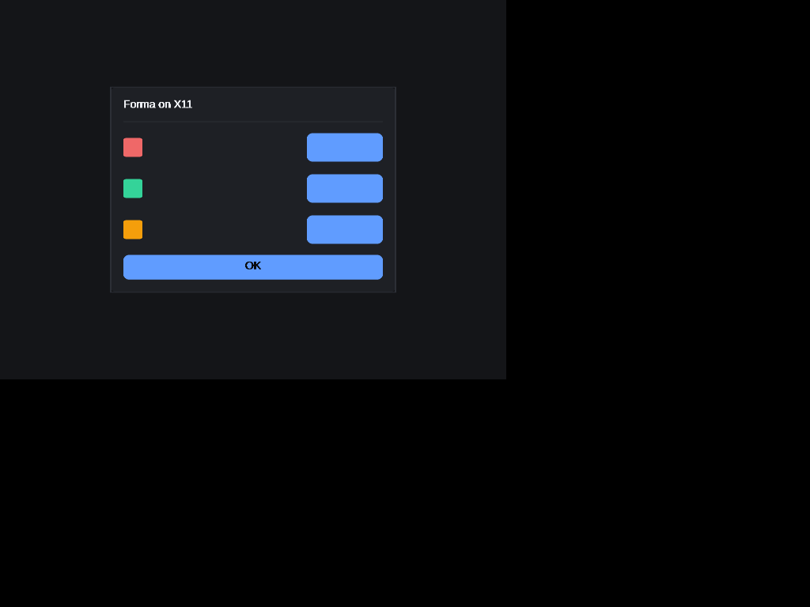
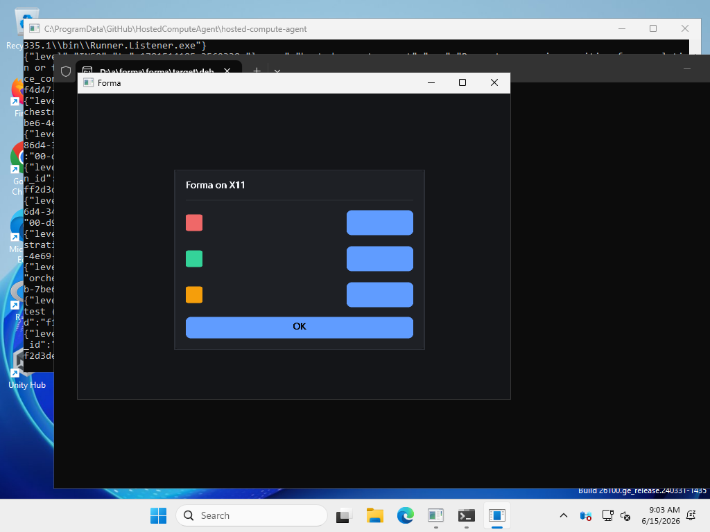
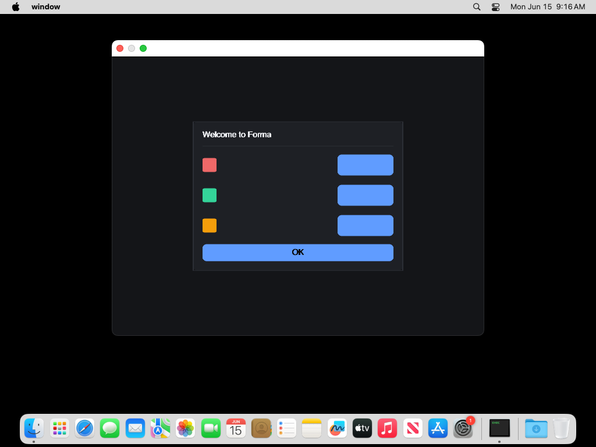
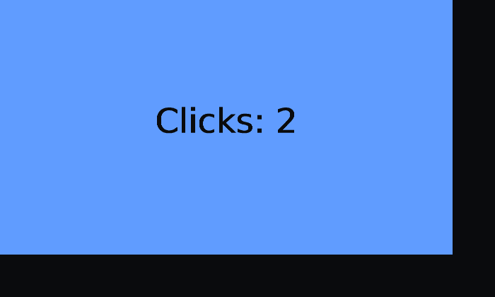
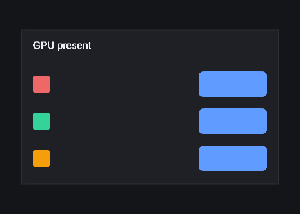
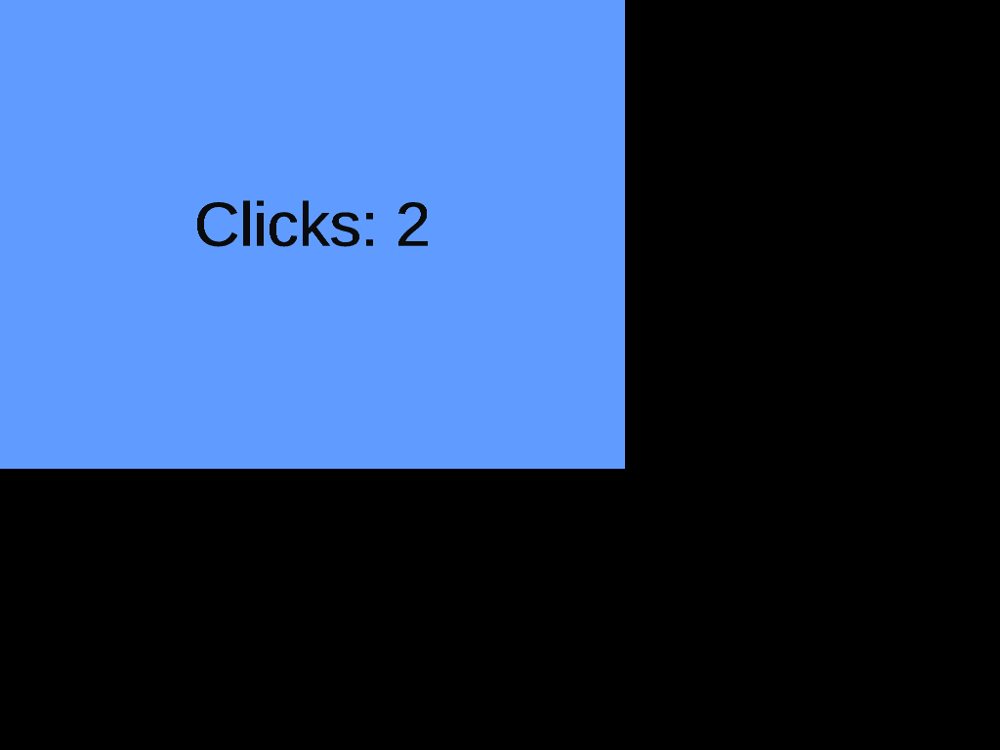
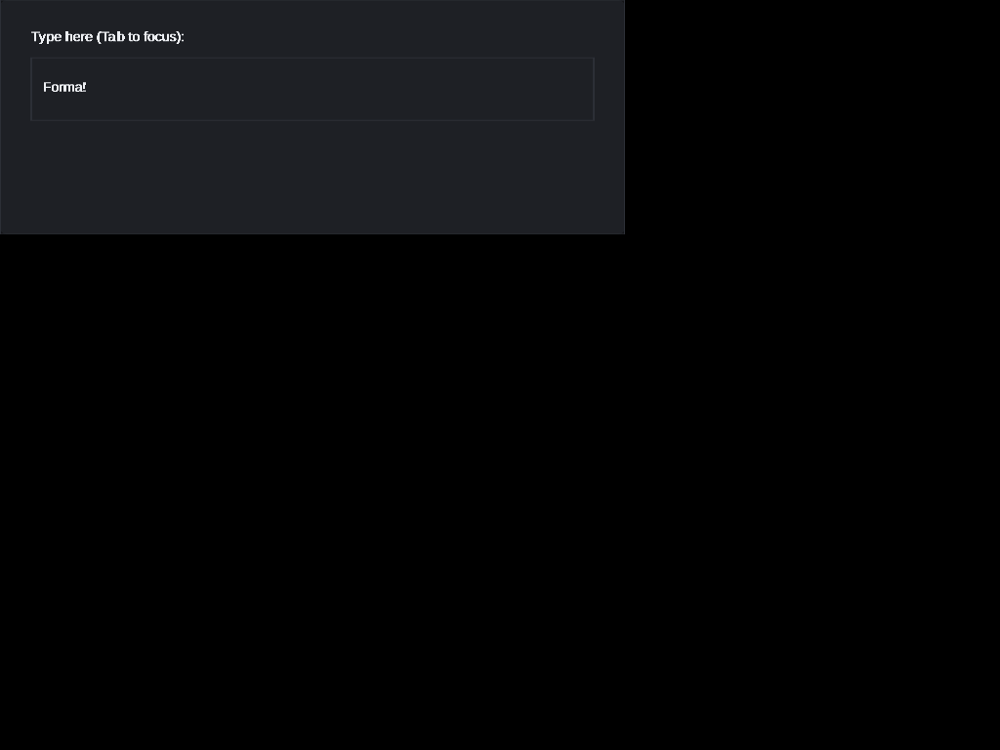
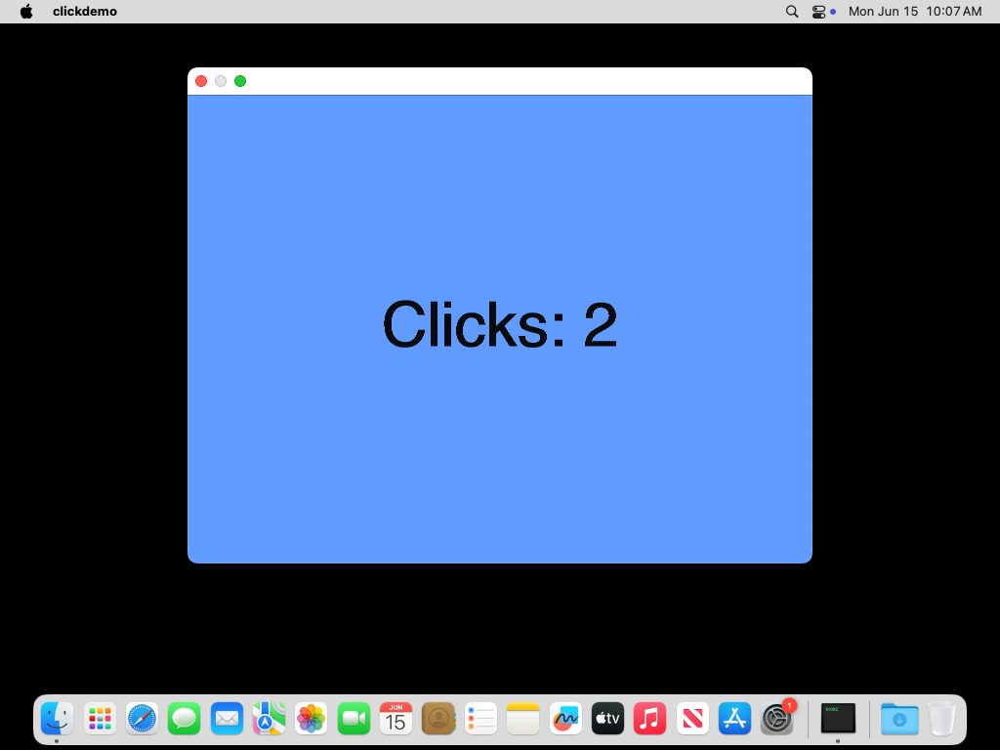

# Forma

A cross-platform UI library and toolkit in Rust.

Forma draws **beautiful, fully themeable, pixel-identical** interfaces on Linux,
macOS, Windows, Android, iOS, and the web — staying **as close to the OS as
possible** while depending on **as little third-party code as possible**.

It builds on the pure-Rust [`oxideav`](https://github.com/OxideAV) media stack
for all 2D content rendering (scene graph, CPU rasterizer, font shaping, image
decode, SVG) and adds everything around it: native windowing and input per OS,
presenting the rendered buffer, and a declarative, reactive UI toolkit.

```rust
use forma::prelude::*;

struct Counter { n: i64 }

fn view(state: &Counter) -> impl View {
    Column((
        Text(format!("{}", state.n)).font_size(48.0),
        Row((
            Button("−").on_tap(|s: &mut Counter| s.n -= 1),
            Button("+").on_tap(|s: &mut Counter| s.n += 1),
        )).gap(8.0),
    ))
    .padding(24.0)
}

fn main() {
    forma::App::new(Counter { n: 0 }, view)
        .title("Counter")
        .run();
}
```

> **Status: pre-alpha.** The architecture and phased plan live in
> [`ROADMAP.md`](./ROADMAP.md). APIs are unstable.

The same app, rendered by Forma's **native backends** and screenshotted in CI
(the `Visual` workflow) on all three desktop OSes — X11 (under Xvfb), Win32,
and Cocoa, each from-scratch with no windowing crates:

| Linux / X11 | Windows / Win32 | macOS / Cocoa | Web / wasm + canvas | GPU / GLES (offscreen) |
|---|---|---|---|---|
|  |  |  |  |  |

Input is verified too: CI synthesizes real events and screenshots the result —
X11 via `xdotool` (clicking a counter, typing into a focused field) and macOS
via `cliclick` (clicking a counter):

| X11 click | X11 type | macOS click |
|---|---|---|
|  |  |  |

## Design at a glance

- **Software-first rendering** behind a GPU-ready `Surface` seam (raw
  Metal/Vulkan/D3D12/WebGPU later — never wgpu).
- **Reactive / declarative** API: UI is a function of state.
- **Self-drawn widgets** — one theme engine, identical on every platform.
- **No** `winit` / `wgpu` / `taffy` / `lyon` / GTK / Qt. OS interfaces are
  hand-written per platform in `forma-platform`.

## Workspace layout

| Crate | Role |
|---|---|
| `forma-geometry` | Logical-pixel math (Point, Size, Rect, Affine) |
| `forma-render` | Scene → oxideav `VectorFrame` → raster → `Surface` |
| `forma-platform` | Per-OS windowing, input, IME, clipboard, vsync |
| `forma-layout` | Flex/box layout solver |
| `forma-core` | Reactive runtime: `View`, reconcile, state, events |
| `forma-anim` | Frame clock, easing, springs, transitions |
| `forma-style` | Design tokens and themes |
| `forma-widgets` | Standard widget library |
| `forma` | Umbrella crate: `App`, prelude, re-exports |

## Examples

```sh
cargo run -p window       # a settings panel in a native window
cargo run -p clickdemo    # a click-counting button
cargo run -p textinput    # an editable text field (Tab to focus, then type)
```

Each opens a real native window (X11/Win32/Cocoa) via `App::run`, or falls back
to a one-shot headless render where no display is available. The web target
lives in `crates/forma-web` (built for `wasm32`; see the `Visual` workflow).

## Status & MSRV

Pre-alpha. The whole workspace builds on **Rust 1.88** (edition 2024).

Working today: the full reactive toolkit (render, layout, state, tap/keyboard/
focus/drag, text, 12 widgets, theming) and **four rendering targets** — native
X11, Win32, and Cocoa (window + input + resize) plus **web** (wasm + canvas) —
each verified by a CI screenshot on its platform.

Next milestones (see `ROADMAP.md`): Wayland, mobile (Android/iOS), and GPU
backends; web font + canvas input.

## License

MIT

